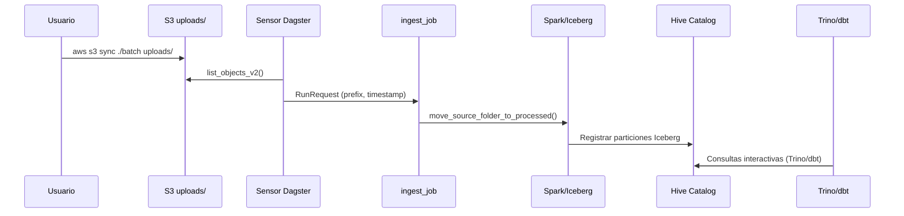

# 🌌 2025 Data Lakehouse Stack

Plataforma de **Data Lakehouse** lista para replicar en un entorno enterprise real: bucket Amazon S3 gestionado vía IAM, catálogo Iceberg respaldado en Hive/MariaDB, cómputo distribuido con Spark, SQL federado mediante Trino, orquestación Dagster y transformaciones dbt, todo aislado en Docker Compose.

> 🧪 **Versionado del stack**
> • MariaDB `10.11`
> • Hive Metastore `3.1.3`
> • Apache Spark Thrift `3.3.2` + Iceberg `1.4.3`
> • Trino `475`
> • Dagster `1.9.10`
> • dbt Core `1.9.2`
> • Docker Compose `≥ 2.20`

---

## 📜 Índice
- [⚡ Requisitos](#-requisitos)
- [🚀 Instalación y arranque](#-instalación-y-arranque)
- [🧱 Arquitectura](#-arquitectura)
- [🌿 Variables de entorno](#-variables-de-entorno)
- [🧰 Comandos útiles](#-comandos-útiles)
- [🔥 Spark · Hive · Iceberg](#-spark--hive--iceberg)
- [🪬 Dagster & dbt](#-dagster--dbt)
- [🛠 Troubleshooting](#-troubleshooting)
- [📝 Changelog](#-changelog)

---

## ⚡ Requisitos

- Docker Engine ≥ 24
- Docker Compose ≥ 2.20
- Usuario IAM con permisos sobre `<TU_BUCKET>`

---

## 🚀 Instalación y arranque

```bash
# Clonar el repositorio
git clone https://github.com/isarubio95/datalake.git
cd datalake

# Crear .env con las variables oficiales
cat <<'ENV' > .env
COMPOSE_PROJECT_NAME=datalake
NETWORK_NAME=datalake

DB_HOST=mariadb
DB_PORT=3306
DB_ROOT_PASSWORD=<TU_CONTRASEÑA>
DB_NAME=metastore_db
DB_USER=hive
DB_PASSWORD=<TU_CONTRASEÑA>

AWS_ACCESS_KEY_ID=<TU_USUARIO_IAM>
AWS_SECRET_ACCESS_KEY=<TU_CONTRASEÑA>
S3_BUCKET=<TU_BUCKET>
AWS_REGION=<TU_REGION>
S3_ENDPOINT=https://s3.amazonaws.com

SPARK_VERSION=3.3.2
ICEBERG_CATALOG=iceberg
ICEBERG_DB=backfat
TRINO_VERSION=475
PYTHON_IMAGE=python:3.10-slim-bookworm

DAGSTER_HOME=/dagster_home
INGEST_PREFIX=uploads/
BRONZE_PREFIX=data/
SILVER_PREFIX=silver/
ENV

# Inicializar base de datos y metastore
docker compose up -d mariadb metastore

# Levantar el resto de servicios
docker compose up -d

# (OPCIONAL) Permitir grandes volúmenes de trabajo
docker exec -it datalake-mariadb mysql -u root -p -e "USE metastore_db; ALTER TABLE job_ticks MODIFY COLUMN tick_body MEDIUMTEXT;"
```

📍 **Interfaces principales**
• Dagster Webserver: [http://<TU_IP>:3000](http://localhost:3000)
• Trino Web UI: [http://<TU_IP>:8081](http://localhost:8081)

---

## 🧱 Arquitectura

### Visión de servicios y conectores

```mermaid
flowchart LR
  subgraph Producers
    GEN[Generador de datos<br/>scripts locales]
  end
  subgraph Storage
    S3[(Amazon S3<br/>data-lake-panoimagen)]
    HIVE[(Hive Metastore)]
    MYSQL[(MariaDB 10.11)]
    SQS[(AWS SQS<br/>uploads queue)]
  end
  subgraph Compute
    DAGSTER[Dagster Webserver & Daemon]
    SPARK[Spark Thrift Server]
    DBTRUN[dbt Runner]
  end
  subgraph SQL
    TRINO[Trino 475]
  end
  USERS[Data Engineers]

  GEN -->|aws s3 cp| S3
  S3 -->|Metadatos Iceberg| HIVE
  HIVE -->|Persistencia| MYSQL
  DAGSTER -->|Sensores & boto3| S3
  DAGSTER -->|Run triggers| SQS
  DAGSTER -->|Catálogo Dagster| MYSQL
  DAGSTER -->|Spark Submit| SPARK
  SPARK -->|s3a://| S3
  SPARK -->|Catalogo Hive| HIVE
  DBTRUN -->|Perfil spark| SPARK
  DBTRUN -->|Perfil trino| TRINO
  TRINO -->|Catalog = iceberg| HIVE
  TRINO -->|Lee Iceberg (s3a)| S3
  USERS -->|UI 3000| DAGSTER
  USERS -->|SQL/API 8081| TRINO
```

- **Amazon S3** aloja zonas `uploads/`, `data/` (bronze) y `silver/`; se accede con firma SigV4 y TLS.
- **Hive Metastore** guarda metadatos Iceberg en MariaDB y expone `thrift://metastore:9083` para Spark y Trino.
- **Dagster** usa sensores sobre `uploads/` y (opcionalmente) el `SQS_QUEUE_URL` para detectar lotes, dispara `ingest_job` y `consolidation_job`, y guarda runs en MariaDB.
- **Spark Thrift Server** ejecuta lectura/escritura `s3a://` con los paquetes Iceberg y AWS, además de exponer JDBC.
- **dbt Runner** comparte perfiles para Spark y Trino, reutilizando un único conjunto de modelos.
- **Trino** monta el catálogo `iceberg` y consulta las mismas tablas Iceberg sin copias adicionales.

### Flujo de datos end-to-end



1. Los productores envían carpetas completas a `s3://data-lake-panoimagen/uploads/` con sus `intrinsics.json`.
2. El sensor de Dagster detecta nuevos prefijos, mueve los objetos a `data/YYYY/MM/DD/` y etiqueta el lote.
3. `consolidation_job` genera CSV/Parquet consolidados en `silver/` y registra tablas Iceberg en el catálogo `iceberg.backfat`.
4. Trino y dbt consultan o transforman sobre el mismo conjunto de tablas Iceberg.

---

## 🌿 Variables de entorno

Consumo desde `.env` y `docker-compose.yml`.

| Variable | Valor ejemplo | Descripción |
|----------|---------------|-------------|
| `COMPOSE_PROJECT_NAME` | `datalake` | Prefijo para nombres de contenedores. |
| `NETWORK_NAME` | `datalake` | Red bridge compartida por los servicios. |
| `DB_HOST` / `DB_PORT` | `mariadb` / `3306` | Endpoint del MariaDB que respalda Hive y Dagster. |
| `DB_ROOT_PASSWORD` | `admin123` | Contraseña root para inicializar la base. |
| `DB_NAME` | `metastore_db` | Base donde Hive persiste los metadatos. |
| `DB_USER` / `DB_PASSWORD` | `hive` / `hivepass` | Usuario de aplicación para Hive y Dagster. |
| `AWS_ACCESS_KEY_ID` / `AWS_SECRET_ACCESS_KEY` | `AKIA…` / `+tsu…` | Credenciales IAM con permisos S3+SQS. |
| `S3_BUCKET` | `data-lake-panoimagen` | Bucket único del lake. |
| `AWS_REGION` | `eu-west-1` | Región usada por boto3 y drivers Hadoop. |
| `S3_ENDPOINT` | `https://s3.amazonaws.com` | Endpoint global para firmas SigV4. |
| `SQS_QUEUE_URL` | `https://sqs.eu-west-1.amazonaws.com/...` | Cola que puede usarse para eventos de ingesta. |
| `SPARK_VERSION` | `3.3.2` | Referencia del runtime Spark. |
| `ICEBERG_CATALOG` / `ICEBERG_DB` | `iceberg` / `backfat` | Espacio lógico de tablas Iceberg. |
| `TRINO_VERSION` | `475` | Imagen oficial usada por Trino. |
| `PYTHON_IMAGE` | `python:3.10-slim-bookworm` | Base para el contenedor dbt. |
| `DAGSTER_HOME` | `/dagster_home` | Ruta persistente para run storage Dagster. |
| `INGEST_PREFIX` | `uploads/` | Prefijo monitorizado por el sensor. |
| `BRONZE_PREFIX` | `data/` | Prefijo destino de bronce. |
| `SILVER_PREFIX` | `silver/` | Prefijo de escritura refinada. |

Añade `AWS_SESSION_TOKEN`, `HTTP(S)_PROXY` o `AWS_CA_BUNDLE` si operas detrás de STS, proxy corporativo o TLS custom.

---

## 🧰 Comandos útiles

```bash
# Iniciar contenedor en segundo plano
docker compose up -d

# Detener stack y limpiar volúmenes
docker compose down -v

# Estado de servicios
docker compose ps

# Logs del daemon de Dagster
docker compose logs -f dagster-daemon

# Ejecutar dbt (perfil trino por defecto)
docker compose exec dbt-runner dbt build --profiles-dir /root/.dbt
```

---

## 🔥 Spark · Hive · Iceberg

- **Spark Thrift Server** escucha en `10000` (JDBC) y UI `4040`; carga `iceberg-spark-runtime`, `hadoop-aws` y `aws-java-sdk` para hablar con S3.
- **Hive Metastore** expone `thrift://metastore:9083` y persiste en MariaDB `metastore_db` (`hive/hivepass`).
- **Iceberg** escribe tablas dentro del catálogo `iceberg` y la base `<TU_DB>`, con particiones por `year/month/day` alimentadas desde Dagster.
- **Compaction**: el job `consolidation_job` crea CSV y Parquet consolidados antes de insertar en Iceberg, reduciendo archivos pequeños.

Puedes depurar con JDBC Hive2 (`spark-thrift:10000`), `spark-sql` dentro del contenedor o usar Trino para verificar consistencia de metadatos.

---

## 🪬 Dagster & dbt

- **Dagster Webserver** (`http://localhost:3000`) expone `ingest_job`, `consolidation_job`, el sensor `s3_process_existing_files_sensor` y el schedule `daily_consolidation_schedule`.
- **Dagster Daemon** recicla credenciales IAM para listar S3/SQS, mueve lotes a bronce y dispara consolidaciones.
- **Persistencia Dagster** vive en MariaDB mediante `dagster-mysql`, lo que habilita backfills y reintentos.
- **dbt Runner** (contenedor `sleep infinity`) comparte el repo por volumen y define perfiles `trino` (catálogo Iceberg) y `spark` (Thrift) dentro de `dbt/profiles.yml`.

Ejecuta dbt dentro del contenedor:

```bash
docker compose exec dbt-runner dbt debug
```

`dbt build` se encadena tras cada ingesta para aplicar tests y snapshots, garantizando que Trino y Spark lean el mismo linaje Iceberg.

---

## 🛠 Troubleshooting

| Síntoma | Posibles causas | Cómo verificar |
|--------|-----------------|----------------|
| Sensor Dagster no detecta archivos | `S3_BUCKET`/`INGEST_PREFIX` incorrectos, permisos IAM insuficientes o clock skew | `docker compose logs dagster-daemon` + `aws s3 ls s3://data-lake-panoimagen/uploads/` |
| Trino lista tablas vacías | Falló la inserción en Iceberg o el catálogo apunta a otro DB | Revisar runs Dagster y `docker compose logs spark-thrift trino` |
| Spark Thrift no arranca | Metastore inaccesible o credenciales S3 ausentes | `docker compose logs spark-thrift` + probar `nc -z localhost 9083` |
| Dagster pierde historial | `DAGSTER_HOME` sin volumen persistente o credenciales DB erróneas | Validar volumen `./dagster_home` y `docker compose logs dagster-webserver` |
| Errores TLS S3 | Endpoint bloqueado por proxy o certificados corporativos | Configura `AWS_CA_BUNDLE` y `HTTPS_PROXY` en los servicios afectados |

---

## 📝 Changelog

- **2025-11-12:** Actualización completa de la guía para reflejar AWS S3, SQS y los nuevos valores de entorno.
